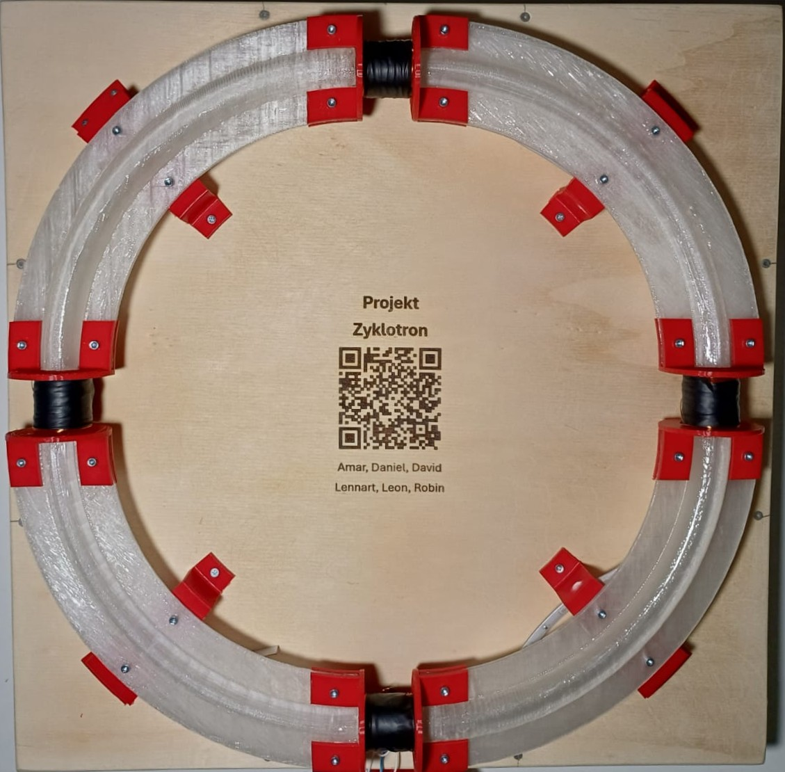

# Projekt-Zyklotron

Das ist unser Versuch eine eine Modell des im Cern betrieenen Zyklotrons zu bauen. Unsere Nachbildung nutzt magnetische Felder um eine Magnetkugel anzutreiben. In diesem Github ist alles was ihr braucht um es zu benutzen und auch nachzubauen.

## Unser [Github](https://github.com/Leonardob999/Projekt-Zyklotron)

## Aufbau
12V an den vorgesehenen Anschlüssen anschließen. 

## Benutzung

Durch drehen des Drehknopfs kann man die Seite die auf den Display angezeigt wird auswählen. Durch drücken des Knopfes wird die Seite bestätigt und man kann jetzt den aktuellen Wert verändern. Durch erneutes betätigen des Knopfes kommt man wieder in die Seitenauswahl zurück.

## Bilder

## Autoren

- [@FritzWilli1](https://www.github.com/FritzWilli1)
- [@Fl4SH3Z](https://www.github.com/Fl4SH3Z)
- [@Danieldev1804](https://www.github.com/Danieldev1804)
- [@Leonardob999](https://www.github.com/Leonardob999)
- [@Amar]
- [@David]

## Quellen
Unsere Zyklotron Nachbildung wurde inspiriert durch ein Video von [@Marcin Poblocki](https://www.youtube.com/watch?v=sm_-i4a_vSU)
