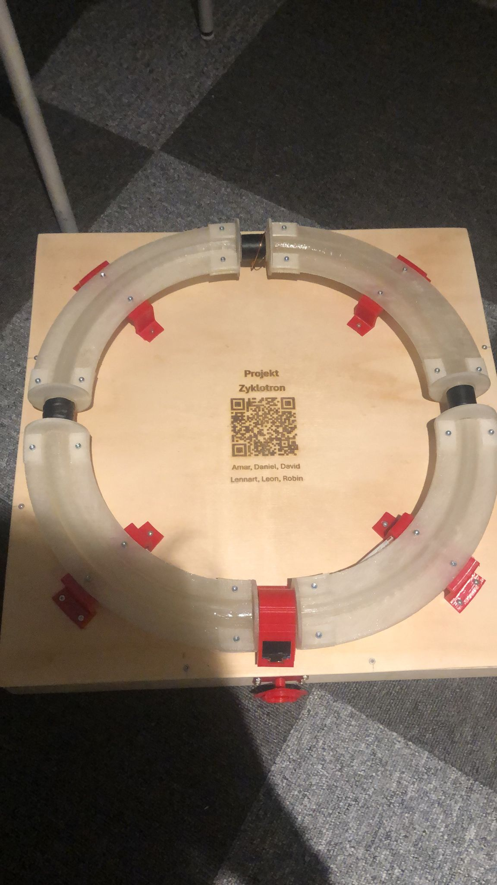

# Projekt-Zyklotron

A brief description of what this project does and who it's for

## Unser [Github](https://github.com/Leonardob999/Projekt-Zyklotron)

## Aufbau
12V an den vorgesehenen Anschlüssen anschließen. 

## Benutzung

Durch drehen des Drehnopfs kann man die Seite die auf den Display angezeigt wird auswählen. Durch drücken des Knopfes wird die Seite bestätigt und man kann jetzt den aktuellen Wert verändern. Durch erneutes betätigen des Knopfes kommt man wieder in die Seiten auswahl zurück.

## Demo

Insert gif or link to demo

## Bilder

## Autoren

- [@FritzWilli1](https://www.github.com/FritzWilli1)
- [@Fl4SH3Z](https://www.github.com/Fl4SH3Z)
- [@Danieldev1804](https://www.github.com/Danieldev1804)
- [@Leonardob999](https://www.github.com/Leonardob999)

## Quellen
Unsere Zyklotron nachbildung wurde inspiriert durch ein Video von [@Marcin Poblocki](https://www.youtube.com/watch?v=sm_-i4a_vSU)
